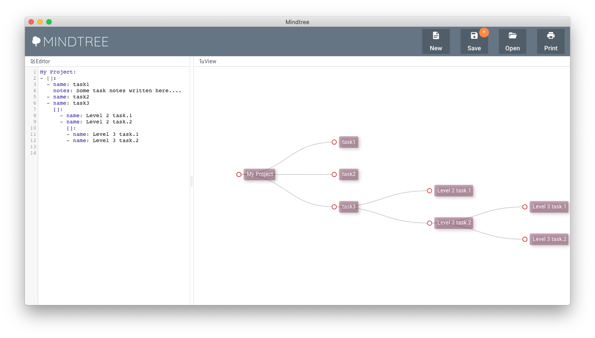

# mindtree
Declarative mind mapping



### Building the Mindtree

Grab latest sources:

```sh
git clone https://github.com/skitsanos/mindtree.git
```

Install dependencies

```sh
cd mindtree
npm install
```

Build

```sh
npm run-script build
```

### Writing mind maps

```yaml
My Project:
- []:
  - name: task1
    notes: Some task notes written here....
  - name: task2
  - name: task3
    []:
      - name: Level 2 task.1
      - name: Level 2 task.2
        []:
        - name: Level 3 task.1
        - name: Level 3 task.2
      
```
